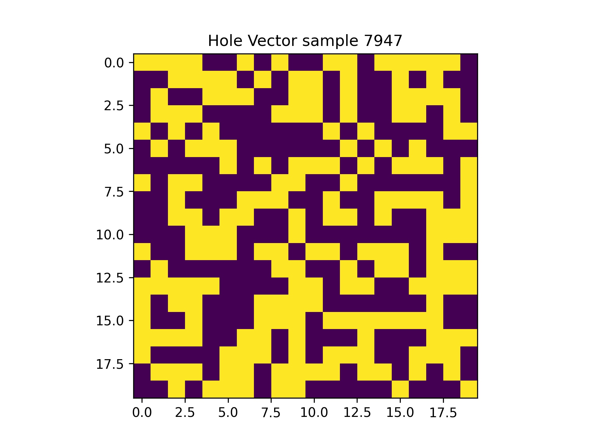

# Numerical Characterization of Photonic  Power Splitter: Optimization Criteria for Forward and Inverse Modeling

## Paper
insert one or two figure here
[Numerical Characterization of Photonic  Power Splitter: Optimization Criteria for Forward and Inverse Modeling](will insert arxiv link here)  
Lubaba Tazrian (github or scholar), Mahmud Elahi Akhter(https://github.com/MahmudShimul) , Sayem Khan (github or scholar), Mainul Hossain (g or s), Rajib Ahmed (g or s), Mirza Mohammad Lutfe Elahi(https://ece.northsouth.edu/~lutfe.elahi/) ,Khaleda Ali (github or scholar) and Sharnali Islam (github or scholar)

If you find this code useful for your research, please cite our [paper](arxiv link):

```
will insert full citation after publication. initially arxiv will be used
```

## Abstract
Placeholder abstract: We demonstrate the characteristics of ultra-compact 1 × 2 silicon optical power splitters with holes of three different dielectric materials: Silicon Dioxide (SiO2), Aluminum Oxide (Al2O3), and Silicon Nitride (Si3N4), through finite-difference time-domain (FDTD) modeling. With optimized hole radius of 35 nm, proposed device area footprint of 2 μm × 2 μm is among the smallest with the best transmission reported so far. A total of 16 thousand unique and random hole patterns were generated for each of the dielectric material and for both TE and TM mode. For each pattern, corresponding transmissions, splitting ratio, and reflection loss were calculated, which gives the dataset working as the main base of the forward modeling, using Machine Learning (ML) algorithms. The dependence of device performance on material and mode, on such large scale random structures, has been analyzed for the first time. The randomness of the datasets is evident through the normal distribution. Si3N4 is found to be the best candidates as holes, since it offers the least scattered distribution of transmittance and projecting minimum 86% transmittance in 96% of data, while exhibiting maximum fabrication tolerance. Forward modeling analysis is done on this Si3N4 dataset using ML algorithms, where Linear Model (LM) and Artificial Neural Network (ANN), are used to build the regression models. The prediction of transmission response predictions was marginally better by LM predictions compared to the ANN. For transparency, this dataset is made open sourced unlike any other prior work. 

## Datasets
Dataset descriptions here and again one or two figures

## Visualization starter code
We have provided a starter code to visualize the hole vector structure of the photonic power splitters. 

### Pre-requisites
* Python 3.6
* pandas
* numpy
* matplotlib

### Running visualization starter
The starter code takes in the desired csv and sample index and outputs a jpg image of the hole vector structure in the provided sample index. (need to fix os path ni code)    
 
```bash
python SiN_TE.csv 50
```
