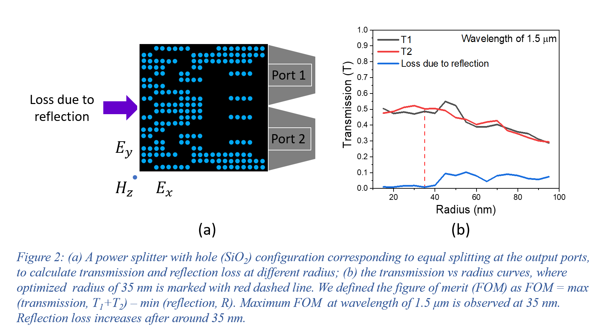
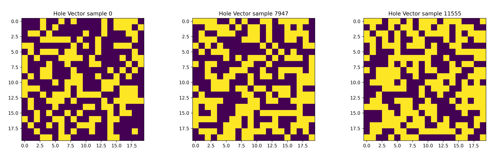

# Numerical Characterization of Photonic Power Splitter: Optimization Criteria for Forward Modeling

## Paper

Numerical Characterization of Photonic Power Splitter: Optimization Criteria for Forward Modeling

[Lubaba Tazrian][LT], [Mahmud Elahi Akhter][projectlink], [Faizul Rakib Sayem][FRS], [Mainul Hossain][MH], [Rajib Ahmed][RA], [Mirza Mohammad Lutfe Elahi][MLE], [Khaleda Ali][KA] and [Sharnali Islam][SI]

[LT]: [https://github.com/LTRahman]
[MEA]: [https://github.com/mandelbrot-walker]
[FRS]: [https://www.researchgate.net/profile/Faizul-Sayem]
[MH]: [https://scholar.google.com/citations?user=RLP3qZsAAAAJ&hl=en]
[RA]: [https://scholar.google.com/citations?user=SmEoIXsAAAAJ&hl=es]
[MLE]: [https://ece.northsouth.edu/~lutfe.elahi/]
[KA]: [https://scholar.google.com/citations?user=zDtDMMcAAAAJ&hl=en]
[SI]: [https://scholar.google.com/citations?user=_FoUlhAAAAAJ&hl=en]
[projectlink]: https://discuss.huggingface.co/t/reproduce-neural-ode-and-neural-sde/7590


## Abstract
Chip-based photonic systems have undergone substantial progresses during the last decade. However, the realization of the photonic devices still depends largely on the intuition based trial and error methods, with limited focus on characteristics analysis. In this work, we demonstrate an in-depth investigation on photonic power splitters by considering the transmission properties of 16,000 unique ultra-compact silicon based structures engraved with nanoholes of SiO2, Al2O3, and Si3N4. The characterization has been performed using finite-difference time-domain (FDTD) simulations for each of the dielectric material and for both TE and TM polarizations at the fundamental modes. The corresponding transmissions, splitting ratio, and reflection loss were calculated, generating the dataset that can be used for both forward and inverse modeling purposes, using Machine Learning (ML) and Deep Learning (DL) algorithms. With an optimized hole radius of 35 nm, the proposed device area footprint of 2 μm × 2 μm is among the smallest with the best transmission reported so far. Si3N4 holes show excellent transmission since it offers 90%  transmittance in 96% of data, while exhibiting maximum fabrication tolerance. Forward modeling analysis, predicting the transmission properties, was done by both Linear Model (LM) and Artificial Neural Network (ANN), where LM showing marginally better accuracy compared to ANN in foreseeing the transmittance. The proposed observation would aid to achieve robust, optimized optical power splitters having wide range of splitting ratios in lesser time.

## Datasets
The datasets inside TE Mode contain the full dataset. Datasets for all three materials, inside TE Mode have the same hole vector structure but different transmission data. TM Mode datasets only contain the transmission details. We did not provide Holve vector for these as they are the same as TE Mode.   

## Visualization starter code
We have provided a starter code to visualize the hole vector structure of the photonic power splitters. 

### Pre-requisites
* Python 3.6
* pandas
* numpy
* matplotlib

### Running visualization starter
The starter code takes in the desired csv and sample index and outputs a jpg image of the hole vector structure in the provided sample index.    
 
```bash
python Visualize.py SiN_TE.csv 50
```


